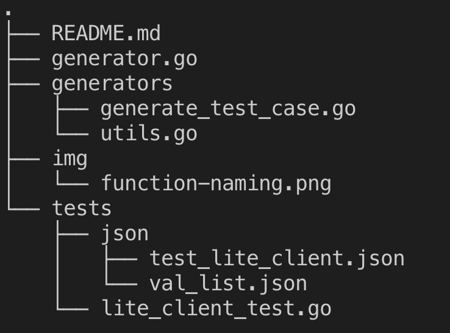
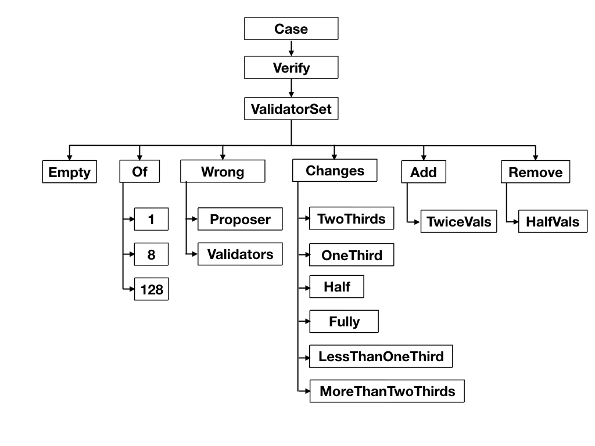

# Language Agnostic Testing

Why do we need this? - [ADR 046](../../docs/architecture/adr-046-language-agnostic-testing.md)

## How to use?

### JSON files

A Json test file has a prefix 'test' followed by the component it targets, 'test_lite_client' for example.

The structure of a test case looks like this:

```
{
    "name": "",
    "description": "",
    "initial": {},
    "input": {},
    "expected_output": ""
}
```

- name: it tells which function this case is intended to test
- description: a brief explanation of the the test case
- initial: an initial state to begin with, sets the context of the test
- input: input parameters that creates the test condition, can be an invalid/balid header for example
- expected_output: in terms of current tests, it tells whether or not to expect an error. It represents an error string and so, where no error is expected, it is empty.

The val_list.json file contains a list of 128 sorted validators and priv_vals to be used by generators.

### Directory Structure (For Now)



This will change when the code is merged with the main repo. Will be updated then!

## Naming Functions

Functions are prefixed with either 'Generate' or 'Case' depending on what they do. For instance, a function that generates first block in the chain is named 'GenerateFirstBlock' and a function that creates the test case, say where validator set changes by two-thirds, is named 'CaseVerifyValidatorSetChangesTwoThirds'. 'Case' is followed by the function name that it is intended to test, which in the above case is 'Verify' function of the Lite Client and the rest describes the case.



* Simplified: 
    - Case + function name + description
    - Generate + name


